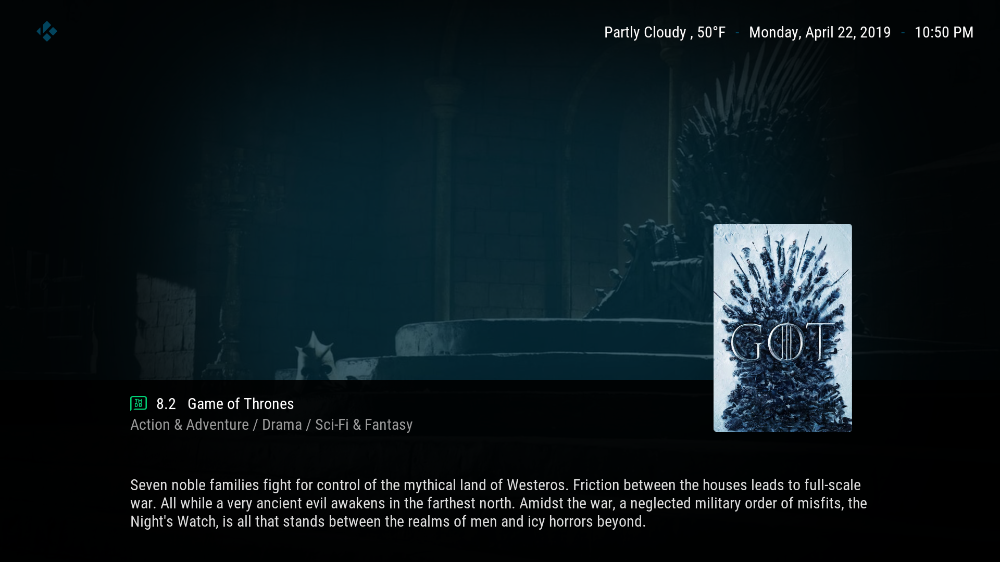
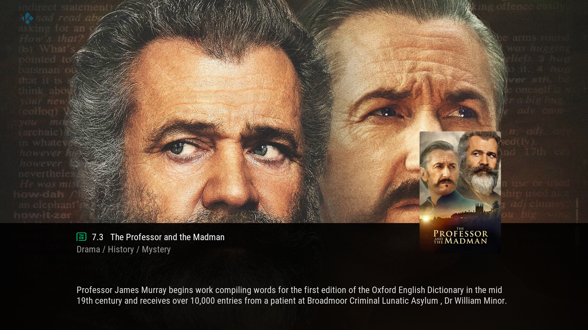
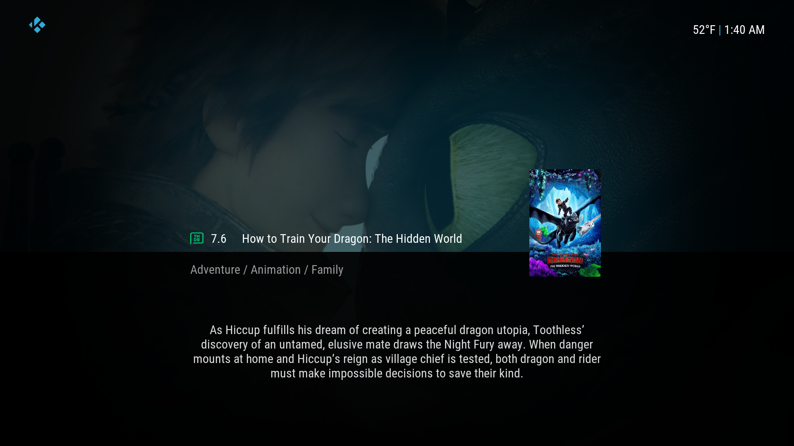
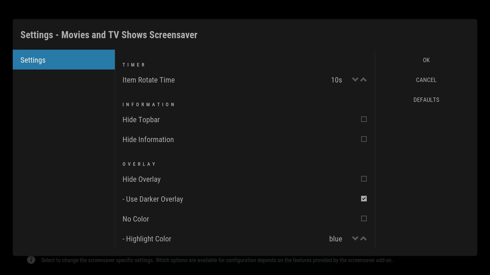

# Movies & TV Show Screensaver

- A Python Script with XML for displaying the layout, written for Kodi.
- A Movie and TV Show Screensaver, data from The Movie Database (TMDB).

A rotating screensaver that updates daily data from The Movie Database on the latest movies and tv shows.

Screensaver Information includes:

- Backdrop / Fanart
- Plot  /Overview 
- Title / Name
- TMDB Rating
- Multiple Genres

Settings include:

- Different Roatation Time Options
- Change Overlay Color Options.
- Enable / Disable Overlay
- Remove Information
- Change Overlay Color and Thickness
- Fanart Only Mode.

---

## Installing:

- Download the zip located at `/zip/script.screensaver.moviesandtvshows.zip`
- In Kodi go to the Addon Browser > Install from Zip File.
- Browse to the download zips location on your system.
- Install the zip file.

To activate the screensaver, go to Settings > Interface Settings > Screensaver > Screensaver Mode. And choose from the list `Movies and TV Shows Screensaver`. It shoud now be your default screensaver. On the same page you may wish to change some `Settings`.

Enjoy!

---

## Screenshots and Images

